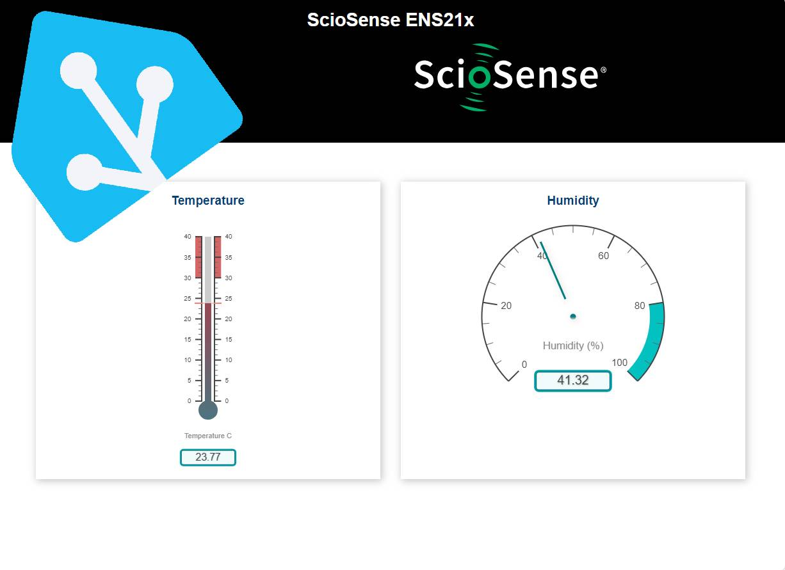

# ENS21x
Project with ScioSense ENS21x family 
**1. ESP32 ESPWebserver Gauges**
- ESP32-S2 mini working as Webserver for ScioSense ENS21x humidity and temperature sensor
- project description on [Hackster.io](https://www.hackster.io/tispace2/precise-temperature-and-humidity-monitor-homeassistant-1f453e) 

    
    
